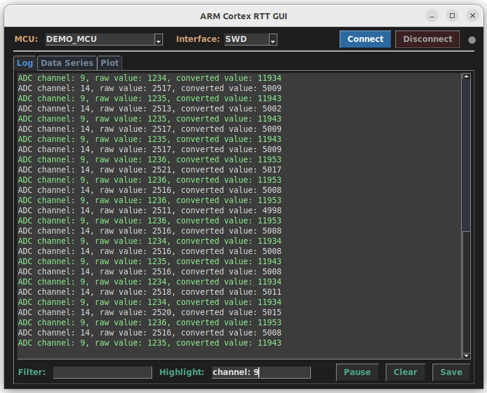
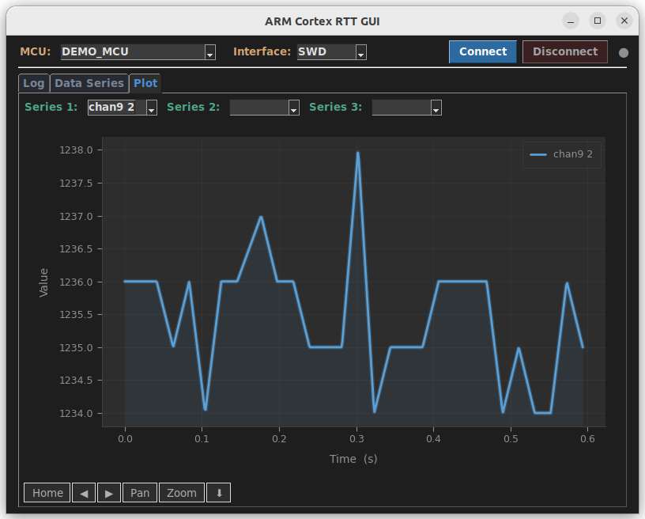
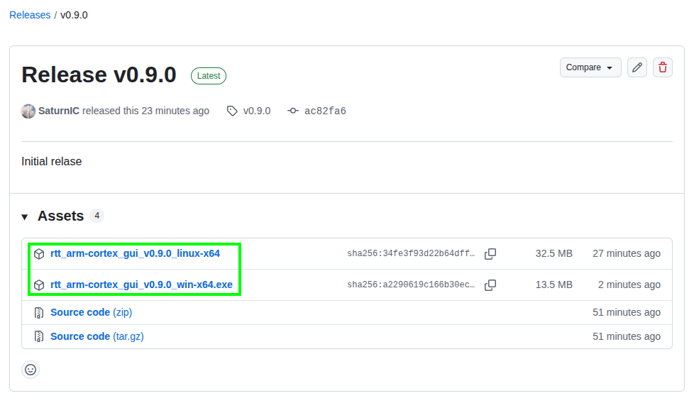

# RTT ARM Cortex SWD/JTAG Logging GUI




## Table of Contents
- [Overview](#overview)
- [Features](#features)
- [Prerequisites](#prerequisites)
  - [Host Software](#host-software)
  - [Embedded Target Setup](#embedded-target-setup)
- [Installation](#installation)
  - [Download Executable](#download-executable)
  - [Manual Installation](#manual-installation)
- [Usage](#usage)
  - [Demo Mode](#demo-mode)
  - [Connecting to an MCU](#connecting-to-an-mcu)
  - [Log Tab](#log-tab)
  - [Data Series Tab](#data-series-tab)
  - [Plot Tab](#plot-tab)
- [Configuration](#configuration)
- [License](#license)

## Overview
This project provides a Python-based GUI to display, filter and highlight real-time ARM Cortex microcontroller log messages
received via SEGGER's Real-Time Transfer (RTT) debug protocol.

This debug protocol provides direct communication with ARM Cortex-based microcontrollers via J-Link debug probes.
RTT removes the need for additional debug channels during development (like UART) by using the ARM Cortex SWD/JTAG interface.
Unlike the slower and clunkier UART debug channel the SWD, JTAG interface provides lean and mean RTT debug messages for ARM MCUs.

This project interfaces directly with the J-Link debug probe drivers,
using the Python library `pylink` which wraps the JLink drivers to interact with a J-Link debug probe.
It does NOT require any other intermediary software like Segger's RTT Viewer.

The pylink library was written by Square Inc. (Now Block Inc.),
open sourced https://github.com/square/pylink
and uploaded to PyPI https://pypi.org/project/PyLink/.

The official documentation and examples for the pylink library
are somewhat lacking when it comes to using the RTT channel,
so this project may also serve as a practical guide for leveraging `pylink` for RTT communication.

## Features
- Direct J-Link connection using native drivers (no other software required)
- **Real-time log display** with filtering and message highlighting
- **Data Series** — define named patterns with `<N>` capture groups to extract numeric values from log lines
- **Pattern Generator** — auto-generate patterns from sample log lines
- **Real-time plotting** — plot up to 3 data series simultaneously with modern dark charts
- **Activate/Deactivate** series independently
- **Pause/Resume** log display
- **Save logs** to file
- **MCU history** — remembers recently used MCUs
- **Config persistence** — MCU history, interface selection, and data series are saved automatically
- **Demo mode** — test without hardware using `--demo-messages`

## Prerequisites

### Host Software
- Python 3.8+ (https://www.python.org/)
- SEGGER J-Link Software ([Download](https://www.segger.com/downloads/jlink))
- Required Python packages (see `requirements.txt`):
  - FreeSimpleGUI
  - pylink-square
  - platformdirs
  - matplotlib

### Embedded Target Setup
Include the SEGGER RTT library in your embedded application.
See: https://www.segger.com/products/debug-probes/j-link/technology/about-real-time-transfer/

```c
#include "SEGGER_RTT.h"

void main() {
    SEGGER_RTT_Init();
    SEGGER_RTT_SetTerminal(0);
    SEGGER_RTT_printf(0, "System started\n");
}
```

## Installation

### Download Executable
Download the matching executable (Windows or Linux) from the releases page:
https://github.com/SaturnIC/RTT-ARM-Cortex-GUI/releases



### Manual Installation
1. Clone the repository:
   ```bash
   git clone https://github.com/SaturnIC/RTT-ARM-Cortex-GUI.git
   cd RTT-ARM-Cortex-GUI
   ```
2. Install dependencies:
   ```bash
   pip install -r requirements.txt
   ```
3. Ensure J-Link drivers are installed on your system.
4. Launch:
   ```bash
   python rtt_python_gui.py
   ```

## Usage

### Demo Mode
Test the application without hardware using the built-in demo mode:
```bash
python rtt_python_gui.py --demo-messages
```
This replays a sample log file so you can explore filtering, highlighting, data series, and plotting.

### Connecting to a real MCU
1. Connect MCU via J-Link to your PC
2. Select your target MCU from the dropdown. Type to filter the list.
3. Select the interface (SWD or JTAG).
4. Click **Connect**. The status dot turns green when connected.
5. Click **Disconnect** to terminate the connection.

### Log Tab
- **Filter** — type a substring to show only matching log lines
- **Highlight** — type a substring to highlight matching text in the log
- **Pause** — freeze the log display while data continues to be received
- **Clear** — reset the log display
- **Save** — export the log to a text file

### Data Series Tab
Define named data series that extract numeric values from log lines using patterns.

**Defining a series:**
1. Enter a **Name** for the series.
2. Define a **Pattern** — use `<N>` to capture a number and `*` to match any text.
3. Click **Add** to create the series.

**Pattern examples:**
| Log line | Pattern | Captured value |
|---|---|---|
| `ADC value: 3.14 V` | `ADC value: <N> V` | 3.14 |
| `Sensor1=100 Sensor2=200` | `Sensor1=<N> *` | 100 |
| `Temperature: 25.6` | `*: <N>` | 25.6 |

**Pattern Generator:**
Click **Pattern Generator** to open a dialog where you can paste a sample log line, type the number to capture, and the pattern is generated automatically.

**Activate/Deactivate:**
Select a series in "Defined Series" and click **Activate** to start capturing data. Use **Deactivate** to stop. Only active series are plotted.

**Clear Data:**
Click **Clear Data** next to "Recorded Values" to clear all captured values.

### Plot Tab
Select up to 3 data series from the dropdowns to plot them in real-time. All series share the same time origin. The chart features:
- Smooth line interpolation
- Glow effect and gradient fill under lines
- Auto-scaling Y-axis
- Custom toolbar (Home, Back, Forward, Pan, Zoom, Save)

## Configuration
The application stores configuration (MCU history, interface selection, data series definitions) in a JSON file at the platform-appropriate user data directory. This is saved automatically on exit or when settings change.

## License
This project is licensed under the Apache License, Version 2.0. See [LICENSE](LICENSE) for more details.
